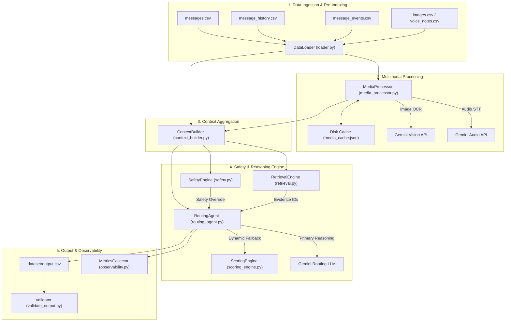
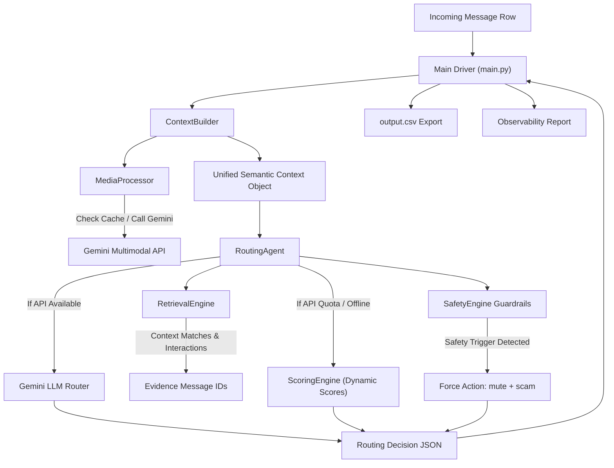
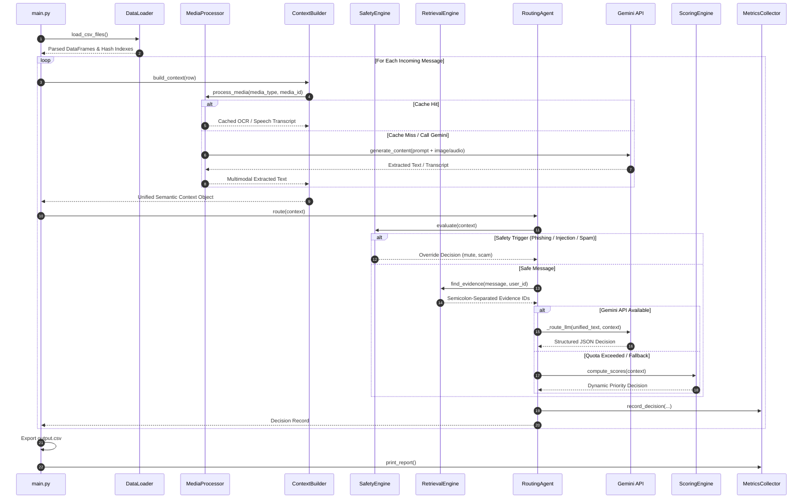
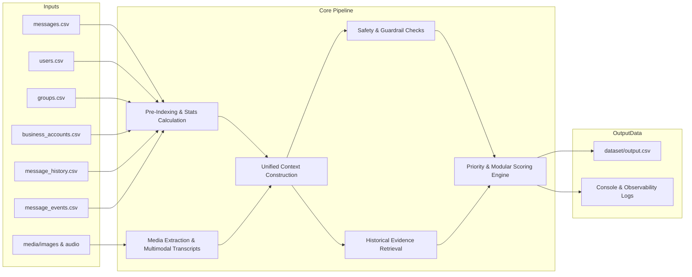
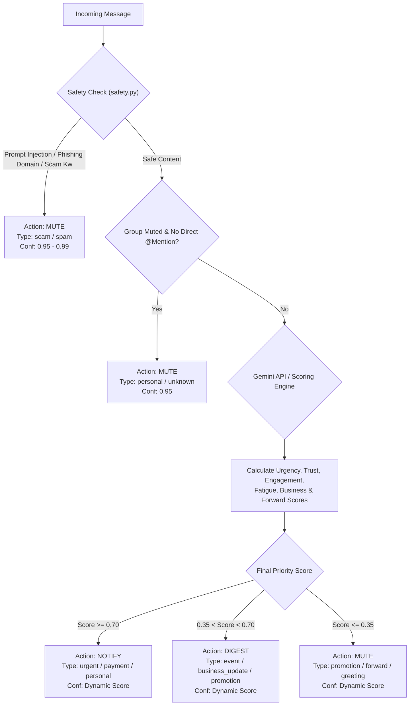

# Architecture Specification - Message Notification Router

This document details the system design, agent interactions, data pipelines, sequence flows, and decision-making logic of the AI-powered WhatsApp Message Notification Router.

---

## 1. System Architecture Diagram

---

## 2. Agent Interaction Diagram

---

## 3. Processing Sequence Diagram

---

## 4. Data Flow Diagram

---

## 5. Decision Flow Diagram

